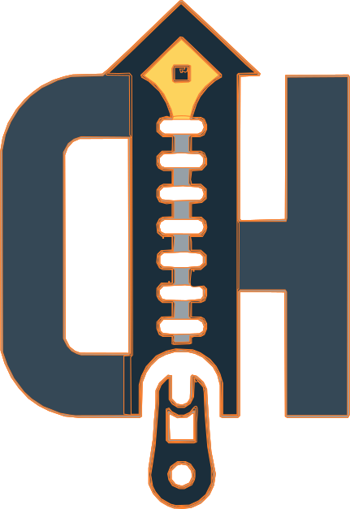

<table>
    <tr>
    <td>
        
    </td>
    <td>
        <h1> Cahir </h1>
    </td>
    </tr>
</table>

[](https://ibrahimtanyalcin.github.io/Cahir/)
[](https://zenodo.org/badge/latestdoi/591137155)
[](https://www.npmjs.com/package/cahir)


[Cahir](dist/cahir.0.0.0.evergreen.umd.js) is a function proxy that allows you interchangibly use tagged templates and method calls. You can use it as an imperative framework with declerative bits. You define the routines and you define the shortcuts.

## The famous TODO wars:
Cahir is an imperative library, but still if you are wondering, this is how it looks:


The characters you use for method calls are completely customizible:

```js
__init__: Cahir.tagify({
        strTransform: str => str
            .trim()
            .replace(/^\/>\s*/,"")
            .replace(/^\|>/, "pipe")
            ...
            .replace(/^👊/gi, "runtime")
            .replace(/^👈/gi, "appendTo")

```

Since `Ch` is a `Proxy`, you get to define how it reacts to keys that it does not have:

```js
ch.div //logs a div DOM object
ch.li //logs a lig object
```

Can even do:

```js
ch[`li{
    "attr":[["data-x", ${15}], ["data-y", ${0}]],
    "prop":[["a",3],["b",2],["innerHTML", ${
        `"<span>Hello World!</span>"`
    }]]
}`] //logs a li with data-x, data-y attributes with span as  child
```


## What are the advantages?:

- Create reusable `tagged template`s via `ch.pickle`
- Allow arbitrary method names to be intercepted
- Use tagged templates to their full potential by allowing marking/spreading `value`s like namespaced variables
- Interchange between tagged templates and method calls: 
```js
`method1 ${arg1}`.method2(arg2)`method3 arg3 ...${rest}`
```
- Create shortcuts to your methods and use them as operators like `->`, `|>`, `+->` in your templates. You can use any character as you want

## Browser/Installation

include the base script and your custom method collections (or the ones included in the `collections` folder of the repo):

```html
<script src="https://cdn.jsdelivr.net/npm/cahir@0.0.1/dist/cahir.0.0.1.evergreen.umd.min.js"></script>
<script src="https://cdn.jsdelivr.net/npm/cahir@0.0.1/collections/DOM/ch.js"></script>
```

## Node/Bun

```shell
npm i cahir
```
```shell
pnpm add cahir
```

## Example
```js
//prepare your function
const ch = new Cahir({
    __init__: Cahir.tagify({
        strTransform: str => str
            .trim()
            .replace(/^\+\s*/,"add")
            .replace(/^x\s*/, "multiply")
            .replace(/^\|>/, "pipe")
    })(function (...args) {
        if (args.length <= 1) {
            this.currentNumber = args[0];
            return this;
        }
        return this[args[0]](...args.slice(1))
    }),
    add: function(a) {
        return this(this.currentNumber + a)
    },
    multiply: function(a) {
        return this(this.currentNumber * a)
    },
    pipe: function(command, ...args) {
        this[command].apply(this, [...args]);
        return this;
    }
})

//usage
ch(1)`
    |> add two:${2}
    x ${({values}) => values.two}
    + ${-10}
`
```

Logging `ch.curentNumber` will result in `-4`. You can save the template and run it later with other parameters:

```js
const pickle = ch.pickle`
    |> add two:${2}
    x ${({values}) => values.two}
    + ${-10}
`

ch(5)(pickle); //ch2.currentNumber === 4
ch(7)(pickle); //ch2.currentNumber === 8
```

## Usage

1) Start with a base function, this will be your primary method. Below function sets an arbitrary property `selected` on itself if given a single argument, otherwise do a method call:
```js
function base (...args) {
    if (args.length <= 1) {
        this.selected = args[0];
        return this;
    }
    return this[args[0]](...args.slice(1))
}
```
2) Use the static `tagify` property on `Cahir` to convert the function for dual use (regular method calls + tagged templates)
```js
const 
    tagger = Cahir.tagify(),
    taggified = tagger(base);
```

3) Provide the resulting function inside a configuration object with `__init__` key to `Cahir`
```js
const ch = new Cahir({
    __init__: taggified,
    method1: function(){...}
    method2: function(){...}
    ...
})
```

4) Now you can interchange between tagged templates and normal method calls:
```js
ch(some_var).method1()`
    method1 ${arg1}
    method2 string-arg1 ${arg2}
`method2(arg1, arg2)(some_other_var)`
...
`
```

5) You can use spread sytax within tagged templates:
```js
ch`
    method ...${some_array}}
    ...
`
```

6) You can mark values within literals to be used later:
```js
ch`
    method my_field:${some_variable}
    method2 string-arg1 ${({values}) => /*do something with values['my_field']*/}
`
```
Values in literals can be anything, with a special case for `function`s. If you pass a `function` object, it will be given the arguments:
```js
{
    thisArg, // Proxy: the proxy `ch` object
    self, //Any: current value in literal
    index, //Number: current index in literal in order of appereance
    values, //Array: all the values in the literal
    strings, //Array: all the strings in the liteal
    stringsTransformed //Array: all the strings after transformations applied
}
```

7) If you want to pass a `function` to a method, use a `function` that returns a `function`:
```js
ch(...)`
    method1 ${({thisArg, values, ...}) => () => /*this function is passed to method1*/}
`
```

If you want to label a `function`, use an object:
```js
ch`
some_method some_label: ${await import("/path/to/some_script.js")}
`
```

```js
ch`
method1 comparer:${{ en: new Intl.Collator("en").compare }}
method2 ${({values}) => values.comparer.en(a, b)}
...
`
```
8) `Cahir.tagify` static method accepts optional arguments:
- `delim` (*string*): used for splitting strings to seprate methods and string arguments 
- `strTransform` (*function*): transform the literal strings before evaluation during parsing
- `valTransform` (*function*): transform the literal values before evaluation during parsing

Default values are reasonable, using a custom `strTransform` allows you to define method shortcuts:

```js
const ch = new Cahir({
    __init__: Cahir.tagify({
        strTransform: str => str
            .trim()
            .replace(/^->/gi,"method1")
            .replace(/^=>/,"method2")
            .replace(/^\|>/, "method_pipe")
    })(function (...args) {
        //your function
    }),
    method1: function(...args) {
        ...
    },
    method2: function(...args) {
        ...
    },
    ...
```

then:

```js
ch`
    -> ${arg1}
    => second:${arg2} |> method1 ...${[arg3, arg4]}
    => ${({values}) => ++values.second}
    ...
`
```
9) `Cahir` accepts `__intercepApply__` and `__interceptGet__` properties on the configuration object. These 2 functions are called with:
- the `ch` proxy as `this`
- `next` to be called with no arguments, if you do **NOT** want to intercept
- `prop` which is the requested property
- `receiver`, same as the [get handler for Proxies](https://developer.mozilla.org/en-US/docs/Web/JavaScript/Reference/Global_Objects/Proxy/Proxy/get)
```js
const ch = new Cahir({
    __init__: taggified,
    method: function(){...}
    __interceptGet__: function (next, prop, receiver) {
        switch (true) {
            case (!(prop in this)):
                return this.method.bind(this, prop)
        }
        next();
    }
})
```
In above, any method that is not defined on `ch` will call `method` with `prop`. So `ch.some_prop_string(arg1)` would be the same as:
```js
ch.method("some_prop_string", arg1)
```
## Webcomponents

Inspect [app code](static/js/app.js) on [card game example](https://ibrahimtanyalcin.github.io/Cahir/) where each game card is a webcomponent:

```js
ch`
    <game-card ${{ data: {values, d} }}/>
    +< ${values.cont}`.selected
```
Above creates a web component `<game-card/>`, appends it to `values.cont` and returns the component (via `.selected`). The string `<game-card...` is converted to a web component using `strTransform` at [ch](static/js/ch.js):
```js
...
strTransform: str => str
    .trim()
    .replace(/^<((?:[a-z]+-+[a-z]*)+)/,"wc $1")
...
```
Above calls `wc` (webcomponent) method on [ch](static/js/ch.js), which in turn calls `game-card` method that is `adopt`ed earlier:

```js
 adopt ...${[
    "game-card", 
    (await import(
        "./component-game-card.js"
    )).render
]}
```
[component-game-card](static/js/component-game-card.js) passes the user defined data to other downstream functions such as [render-card](static/js/render_card.js)

When creating webcomponents, you can provide several properties
```js
        ch`<game-card ${{
            attrs = [["data-x", "y"], ...],
            styles = [["width", "auto"], ...],
            props = [["x", x], ["y", y], ...],
            data = "Any arbitrary value",
            innerHTML = Function|String,
            select = truthy|falsey
        }}/>`
```
All these are passed to method `game-card` or whatever name you assigned during adopting.

`wc` implementation of `ch` uses `Symbol`s to detect and call `connectedCallback` only **ONCE**. To detect multiple additions/removals from DOM, you can use custom functions or `MutationObserver`. Or you can define your custom `wc`.

## Credits

Card data for the [website]() was taken from [gwent.one](https://gwent.one/).

## Contributions

### Ch implementations

You can help documenting different `Ch` implementations under [collections](collections) using `JSDoc` syntax

### PRs

Reasonable PRs are always welcome:

For `Cahir` itself:
- state the bug/feature clearly
- state what the proposition does
- submit few test cases

For method collections:
- state what the collection is aimed at (*DOM manipulation, data visualization, calculations etc.*)
- explain method briefly in `JSDoc` syntax
- include examples if possible